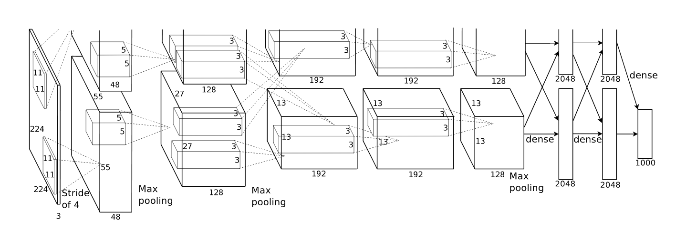
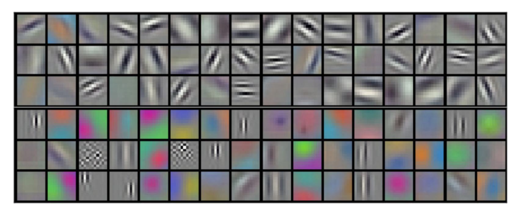

# MODERN DEEP LEARNING ERA

# Breakthrough Paper

"ImageNet Classification with Deep Convolutional Neural Networks", Alex Krizhevsky, Ilya Sutskever, Geoffrey E. Hinton, 2013

- substantially better performance than previous methods
- effective use of GPUs for convolutional neural networks
- ReLU nonlinearity
- max pooling
- data augmentation
- dropout, local response normalization
- much bigger than previous networks

None of these were new ideas, but this paper brought it all together.

# Aside... lots of work

Deep Learning didn't come out of nothing.

The major people in the field today tried to push it for 20 years compared to other approaches.

Finally succeeded in the 2010's due to Alexnet.


# Alexnet Architecture


```python
from torch import nn
from torchmore import flex, layers
```

```python
# Alexnet Architecture (approximately)

model = nn.Sequential(
    layers.Input("BDHW", sizes=(None, 3, 224, 224)),
    flex.Conv2d(2*48, (11, 11)),
    nn.ReLU(),
    nn.MaxPool2d((2, 2)),
    flex.Conv2d(2*192, (3, 3)),
    nn.ReLU(),
    flex.Conv2d(2*192, (3, 3)),
    nn.ReLU(),
    flex.Conv2d(2*128, (3, 3)),
    layers.Reshape(0, [1, 2, 3]),
    flex.Linear(4096),
    nn.ReLU(),
    flex.Linear(4096),
    nn.ReLU(),
    flex.Linear(1000)
)
```


# Alexnet Learned Features



NB: these are standard PCA/Gabor-jet style features from vision>


# ReLU


$\sigma(x) = (1 + e^{-x})^{-1}$, $\rho(x) = \max(0, x)$

# ReLU Derivatives


# Nonlinearity Properties

<table style="font-size: 44px">
    <tr><th>property</th><th>sigmoid</th><th>ReLU</th></tr>
    <tr><td>derivatives</td><td>infinite</td><td>f': discontinuous, f'': zero</td></tr>
    <tr><td>monotonicity></td><td>monotonic</td><td>monotonic</td></tr>
    <tr><td>range</td><td>$(0, 1)$</td><td>$(0, \infty)$</td></tr>
    <tr><td>zero derivative</td><td>none</td><td>$(-\infty, 0)$</td></tr>
</table>


# ReLU

- much faster to compute
- converges faster
- scale independent
- existence of zero-derivative regions causes "no deltas"
- units may "go dead"
- positive output only
- results in piecewise linear approximations to functions
- results in classifiers based on linear arrangements

# Max Pooling


- replaces average pooling, reduces resolution
- performed per channel
- nonlinear operation, somewhat similar to morphological operations

# Local Response Normalization

$$ y = x \cdot (k + \alpha (K * |x|^\gamma) ^ \beta)^-1 $$

- Here, $*$ is a convolution operation.
- That is, we normalize the image with an average of the local response. 
- In Alexnet, $k=2$, K is a 5x5 pillbox, $\gamma=2$, $\beta=0.75$
- A simple variance normalization would use $k=0$, $\gamma=2$, and $\beta=0.5$

In later models, this is effectively replaced by batch normalization.

# Dropout

- randomly turn off units during training
- motivated by an approximation to an ensemble of networks
- intended to lead to better generalization from limited samples

# Data Augmentation

- generate additional training samples by modifying the original images
- long history in OCR
- for image training:
  - random geometric transformation
  - random distortions
  - random photometric transforms
  - addition of noise, distractors, masking

# FURTHER DEVELOPMENTS

# Batch Normalization

"Batch Normalization: Accelerating Deep Network Training by Reducing Internal Covariate Shift", S. Ioffe and C. Szegedy, 2015.

- attributes slower learning to "internal covariate shift"
- suggests that ideally, each layer should "whiten" the data
- instead normalizes mean and variance for each neuron
- normalization based on batch statistics (and running statistics)

# Inception

Szegedy, Christian, et al. "Rethinking the inception architecture for computer vision." Proceedings of the IEEE conference on computer vision and pattern recognition. 2016.

- very deep architecture built up from complex modules
- separable convolutions for large footprints
- "label smoothing"

# VGG Networks

Simonyan, Karen, and Andrew Zisserman. "Very deep convolutional networks for large-scale image recognition." arXiv preprint arXiv:1409.1556 (2014).

- very deep networks with fairly regular structure
- multiple convolutions + max pooling
- combined with batch normalization in later systems

# Residual Networks

He, Kaiming, et al. "Deep residual learning for image recognition." Proceedings of the IEEE conference on computer vision and pattern recognition. 2016.

- novel architecture composed of modules
- each module consists of convolutional layers
- the output of the convolutional layers is added to the input
- ReLU and batch normalization is used throughout

# LOCALIZATION

# Localization of Objects

- objects occur at different locations in scenes/images
- different strategies with recognizing objects:
  - global classification
  - moving/scanning window
  - region proposals (RCNN etc.)
  - learning dense markers / segmentation

# Global Classification
```python
def conv2d_block(d):
    return nn.Sequential(
        flex.Conv2d(d, 3, padding=1), flex.BatchNorm2d(), flex.ReLU(),
        flex.Conv2d(d, 3, padding=1), flex.BatchNorm2d(), flex.ReLU(),
        flex.MaxPool2d(),
    )

def make_vgg_like_model():
    return nn.Sequential(
        *conv2d_block(64), *conv2d_block(128), *conv2d_block(256), 
        *conv2d_block(512), *conv2d_block(1024), *conv2d_block(2048),
        # we have a (None, 2048, 4, 4) batch at this point
        layers.Reshape(0, [1, 2, 3]),
        flex.Linear(4096), flex.BatchNorm(), nn.ReLU(),
        flex.Linear(4096), flex.BatchNorm(), nn.ReLU(),
        flex.Linear(1000)
    )
```


# Sliding Windows


Sermanet, Pierre, et al. "Overfeat: Integrated recognition, localization and detection using convolutional networks." arXiv preprint arXiv:1312.6229 (2013).


# Region Proposal Network


Ren, Shaoqing, et al. "Faster r-cnn: Towards real-time object detection with region proposal networks." Advances in neural information processing systems. 2015.


# Summary - New Style Object Recognition Networks

- tricks: ReLU, batch norm, max pool, softmax, cross-entropy
- hacks: ad-hoc collections of kernels, R-CNN
- working at the limits of current GPU hardware
- little theoretical foundation, "Wild West"
- odd effects: deep dreaming, adversarial samples, etc.

```python

```
