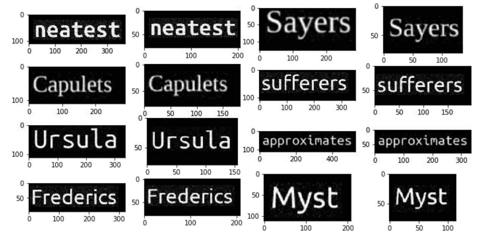

```python
%pylab inline
```

```python
import torch
from torch import nn
from torchmore import layers, flex
```


# SEQUENCE MODELING AND RECURRENT NETWORKS

# Recurrent Networks

Consider a sequence of samples: $x_t$ for $t \in \{0...n\}$
Want to produce an output sequence $y_t$

Convolutional/TDNN models: 

$$y_t = f(x_{t},...,x_{t-k})$$

Recurrent Models:

$$y_t = f(x_t, y_{t-1})$$

# Recurrent Networks vs Linear Filters

Recurrent neural networks are generalizations of IIR linear filters.

Finite Impulse Response Filter

$$ y_i = L(x_{i}, ..., x_{i-k})$$

Infinite Impulse Response Filter

$$ y_i = L(x_{i-1}, x_i) $$

$L$: linear function


# Simple Recurrent Model


# Unrolling and Vanishing Gradient


# LSTM as Memory Cell


# LSTM Networks

LSTMs are a particular form of recurrent neural network.

Output computation ($L_s$ uses $\tanh$):

state: $s_t = f_t \odot s_{t-1} + i_t \odot L_s(x_t, y_{t-1})$

output: $y_t = o_t \odot s_t$

$f_t$, $i_t$, and $o_t$ are gates (linear layers, sigmoidal output), $L_s$ is a linear layer with $\tanh$ output

# Bidirectional LSTM


# LSTM for OCR (simple)


Simple approach to OCR with LSTM:
- assume a W x H x 1 input image
- consider this a sequence of W vectors of dimension H
- use these vectors as input to a (BD)LSTM
- perform CTC alignment

# LSTM for OCR (simple)
```python
def make_model():
    return nn.Sequential(
        layers.Input("BDHW", sizes=[None, 1, 48, None]),
        layers.Reshape(0, [1, 2], 3),
        layers.Reorder("BDL", "LBD"),
        layers.LSTM(100)
    )

def train_batch(input, target):
    optimizer.zero_grad()
    output = model(input)
    loss = ctc_loss(output, target)
    loss.backward()
    optimizer.step()
```


# LSTM for OCR (simple)

- does not work for unconstrained inputs
- works well for size and position normalized inputs
- works much like an HMM model for OCR

Breuel, Thomas M., et al. "High-performance OCR for printed English and Fraktur using LSTM networks." 2013 12th International Conference on Document Analysis and Recognition. IEEE, 2013.

# Size/Position Normalization for LSTM OCR



# Size/Position Normalization

For binary word images:

- pick a target image height $h$
- find the centroid $\mu$ and the covariance matrix $\Sigma$ of the pixels
- compute an affine transform that:
  - moves $\mu_y$ to $h/2$
  - scales $\Sigma_{yy}^{1/2}$ to $h/2$

More complex:
- grayscale images $\rightarrow$ simple thresholding first
- long lines $\rightarrow$ compute $\mu_y$ and $\Sigma_{yy}$ in overlapping windows for each $x$

# Word/Line Recognition with Size Normalization

Word image normalization can go into the dataloader's data transformations (or be precomputed):
```python
transforms = [
    lambda image: size_normalize(image),
    lambda transcript: encode_text(transcript)
]

def make_loader():
    return DataLoader(WebDataset(..., transforms=transforms))
```

<!-- #region -->

# Combining Convolutional Nets with LSTM


We can easily combine convolutional layers with LSTM:

- 2D convolutional network for preprocessing\
- reduction to 1D sequence
- 1D LSTM modeling

Breuel, Thomas M., et al. "High-performance OCR for printed English and Fraktur using LSTM networks." 2013 12th International Conference on Document Analysis and Recognition. IEEE, 2013.
<!-- #endregion -->
# Combining Convolutional Nets with LSTM

```python
def make_model():
    return nn.Sequential(
        *convnet_layers(),
        layers.Fun("lambda x: x.sum(2)"), # BDHW -> BDW
        layers.Reorder("BDL", "LBD"),
        flex.LSTM(d, bidirectional=True, num_layers=num_layers),
        layers.Reorder("LBD", "BDL"),
        flex.Conv1d(noutput, 1),
        layers.Reorder("BDL", "BLD")
    )
```


Breuel, Thomas M. "High performance text recognition using a hybrid convolutional-lstm implementation." 2017 14th IAPR International Conference on Document Analysis and Recognition (ICDAR). Vol. 1. IEEE, 2017.


# Projection Options

Going from "BDHW" image to "BDL" sequence, we have several options:

- `x.sum(2), x.max(2)`
    - position/scale independent
- `Reshape(0, [1, 2], 3)`
    - position dependent, after normalization
- `BDHW_to_BDL_LSTM`
    - trainable reduction, works either position dependent or independent
    

# Reduction with LSTM

Reduction with LSTM is similar to seq2seq models: it reduces an entire sequence (pixel rows or columns in this case) to a final state vector.
```python
class BDHW_to_BDL_LSTM(nn.Module):
    ...
    def forward(self, img):
        b, d, h, w = img.size()
        seq = layers.reorder(img, "BDHW", "WBHD").view(w, b*h, d)
        out, (_, final) = self.lstm(seq)
        return layers.reorder(final.view(b, h, noutput), "BHD", "BDH")
```


# 2D Scanning

FIXME


# Chinese Menu Style Text Recognition

- **input**: normalized, word normalized, line normalized
- **convolutional** layers: VGG-like, Resnet-like, FMP, U-net-like
- **scaling layers**: none, interpolation, transposed convolution
- **reduction**: sum, max, concat/reshape, LSTM
- **sequence modeling**: none, LSTM, 2D


# What should you use?

Some rules of thumbs:

- sum/max/LSTM reduction with unnormalized, concat/LSTM with normalized
- normalized + convolution + LSTM: good for printed Western OCR
- unnormalized + convolution + LSTM: scene text, handwriting
- unnormalized + convolution: faster scene text, lower performance

Large literature trying many different combinations of these.


# Which is "best"?

Results depend on many factors:

- character set: #classes, fonts, etc.
- dataset: noise/degradation, distortions, etc.
- training set size and variability
- available training and inference hardware
- precise architecture choice
- training schedule and method

There is no single "best" method.

Any one method can be "best" for some circumstances
